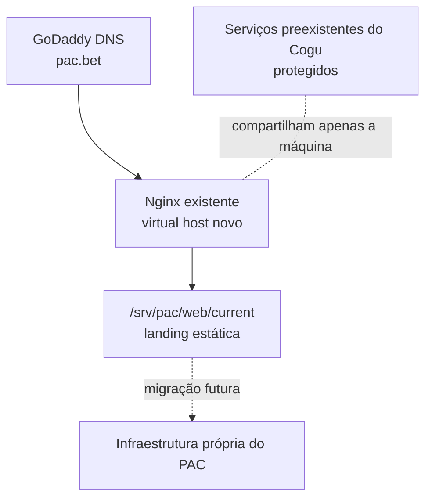

# PAC (`pac.bet`)

Documento mestre de arquitetura, implantação temporária, operação segura e migração.

> **Estado atual em 28/07/2026:** este repositório contém somente documentação. A landing page ainda não foi desenvolvida, não existe deploy do PAC na VPS, o DNS não foi apontado para a VPS e nenhuma configuração do Cogu foi alterada.

Este README foi escrito para servir como fonte de contexto para pessoas e agentes de inteligência artificial. Antes de executar qualquer trabalho de infraestrutura, leia o documento inteiro.

---

## 1. Objetivo

O PAC começará como uma landing page institucional estática em `pac.bet`.

Durante a fase inicial, o site poderá usar temporariamente a mesma VPS Hostinger que já sustenta serviços do Cogu. Essa decisão serve apenas para evitar a contratação imediata de outra hospedagem.

O projeto deve nascer preparado para:

- permanecer tecnicamente isolado do Cogu;
- receber aplicação, API, banco de dados e outros serviços no futuro;
- ser migrado para infraestrutura própria sem depender da arquitetura do Cogu;
- permitir deploy e rollback reproduzíveis;
- ser compreendido e operado com segurança por outra pessoa ou agente;
- nunca exigir mudanças destrutivas nos serviços preexistentes da VPS.

O compartilhamento da VPS é temporário. O compartilhamento de código, dados, credenciais, deploys ou serviços com o Cogu é proibido.

---

## 2. Estado conhecido e nível de confiança

| Item | Estado conhecido | Fonte / observação |
|---|---|---|
| Repositório | `gezada/pac`, branch padrão `main` | Confirmado pelo GitHub |
| Visibilidade | Público | Não versionar segredos ou dados privados |
| Domínio | `pac.bet` | Registrado na GoDaddy |
| DNS atual | Nameservers na GoDaddy; raiz ainda ligada ao Website Builder; `www` aponta para `pac.bet` | Observado em 28/07/2026; reconfirmar antes de qualquer mudança |
| Produto inicial | Landing page institucional estática | Decisão confirmada |
| Hospedagem inicial desejada | VPS Hostinger já usada por serviços do Cogu | Planejado, ainda não executado |
| Docker no PAC inicial | Não será usado | Decisão confirmada |
| Banco de dados do PAC | Não existe nesta fase | Será próprio quando necessário |
| Deploy automático | Planejado, ainda não configurado | Implementar depois do primeiro deploy controlado |
| Endereço IP da VPS | Não confirmado neste repositório | Deve ser obtido diretamente no hPanel ou por SSH autorizado |
| Capacidade livre da VPS | Não auditada | Conferir CPU, RAM, disco, portas e carga antes do deploy |
| Firewall e exposição de portas | Não auditados | Conferir antes de adicionar qualquer serviço |

**Regra de confiabilidade:** dados obtidos por inspeção atual e somente leitura da VPS prevalecem sobre este documento. Se houver divergência, interrompa a execução, registre o que foi encontrado e atualize a documentação antes de continuar.

---

## 3. Contexto da infraestrutura existente

A documentação atual do Cogu indica a seguinte separação:

- `cogu.gg` e `dash.cogu.gg` são publicados na hospedagem compartilhada da Hostinger;
- a VPS hospeda serviços protegidos do Cogu, incluindo API, Nginx, certificados TLS, PostgreSQL, Redis e um runner de deploy;
- a API do Cogu é gerenciada pelo `systemd`;
- PostgreSQL e Redis do Cogu usam Docker;
- o Nginx da VPS já recebe tráfego de domínio e atua como reverse proxy;
- o Certbot já é usado para certificados.

Fontes internas para conferência, sempre em modo de leitura:

- [`gezada/cogu/ops/DEPLOY.md`](https://github.com/gezada/cogu/blob/main/ops/DEPLOY.md)
- [`gezada/cogu/.github/workflows/deploy-api.yml`](https://github.com/gezada/cogu/blob/main/.github/workflows/deploy-api.yml)
- [`gezada/cogu/docker-compose.yml`](https://github.com/gezada/cogu/blob/main/docker-compose.yml)

Esses arquivos pertencem ao projeto Cogu. Não devem ser editados como parte do PAC.

No momento da análise inicial, a integração disponível da Hostinger não fornecia acesso administrativo à VPS, ao SSH ou ao hPanel. Por isso, capacidade, processos, portas, firewall e IP público continuam pendentes de verificação direta.

---

## 4. Limite de segurança do Cogu

Esta é a regra mais importante do projeto:

> **Tudo que já existia na VPS antes do PAC deve ser tratado como protegido. Somente recursos criados explicitamente para o PAC podem ser alterados pelo projeto PAC.**

### 4.1 Recursos permitidos para o PAC

Um agente pode trabalhar apenas nos seguintes alvos, depois de autorização:

- repositório `gezada/pac`;
- domínio `pac.bet` e seu subdomínio `www`;
- diretório dedicado `/srv/pac`;
- virtual host novo `/etc/nginx/sites-available/pac.bet`;
- link novo `/etc/nginx/sites-enabled/pac.bet`;
- logs novos identificados como `pac.bet`;
- certificado novo emitido apenas para `pac.bet` e `www.pac.bet`;
- usuário de deploy exclusivo do PAC;
- secrets, environments e workflows pertencentes ao repositório `gezada/pac`;
- no futuro, serviços, containers, redes, volumes e bancos identificados inequivocamente como pertencentes ao PAC.

### 4.2 Recursos proibidos

Sem uma solicitação separada, explícita e específica, é proibido:

- modificar qualquer arquivo do repositório `gezada/cogu`;
- alterar workflows, secrets, runners ou deploys do Cogu;
- alterar DNS de `cogu.gg` ou de seus subdomínios;
- editar ou substituir virtual hosts existentes no Nginx;
- parar, reiniciar, renomear ou remover serviços do Cogu;
- reutilizar banco, schema, usuário, senha, volume, rede ou Redis do Cogu;
- reutilizar variáveis de ambiente ou chaves do Cogu;
- mudar versões globais de Node.js, Docker, Nginx, Certbot ou do sistema operacional;
- reiniciar a VPS ou realizar atualização geral do sistema;
- executar limpeza global do Docker, de volumes, de imagens ou de redes;
- executar comandos destrutivos sobre diretórios amplos;
- inferir que um IP usado por FTP é o IP da VPS;
- alterar firewall sem mapear e preservar todas as regras existentes;
- usar o runner do Cogu para o PAC apenas por ele já estar instalado.

### 4.3 Comandos incompatíveis com este projeto

Os seguintes tipos de comando não devem fazer parte de uma implantação do PAC:

```text
docker system prune
docker volume prune
docker network prune
docker compose down executado fora de um diretório exclusivo do PAC
remoção recursiva de /root, /srv, /var/www, /etc/nginx ou diretórios do Cogu
git reset --hard dentro de qualquer checkout do Cogu
substituição integral de nginx.conf
```

Ao operar a VPS, prefira mudanças aditivas, arquivos novos, nomes exclusivos, validação antes de reload e rollback explícito.

---

## 5. Arquitetura da primeira fase



### 5.1 Componentes

| Camada | Solução inicial | Motivo |
|---|---|---|
| Código | Repositório `gezada/pac` | Isolamento e histórico próprios |
| Build | GitHub-hosted runner | Evita usar CPU e runner do Cogu para compilar |
| Artefato | HTML, CSS, JavaScript e assets estáticos | Não exige processo de aplicação na VPS |
| Publicação | Upload por SSH para uma nova release | Deploy reproduzível e isolado |
| Servidor web | Nginx já instalado, com virtual host exclusivo | Aproveita a entrada HTTP/HTTPS existente sem adicionar outro proxy |
| TLS | Certbot / Let's Encrypt para os dois nomes do PAC | Certificado independente |
| DNS | GoDaddy | Não é necessário trocar nameservers |
| Backend | Nenhum | Não existe necessidade nesta fase |
| Banco | Nenhum | Não existe necessidade nesta fase |
| Docker | Nenhum para a landing | Complexidade sem benefício nesta fase |

### 5.2 Princípio de portabilidade

A VPS não deve conter a única cópia de nada importante. A fonte da verdade da landing é o GitHub; a VPS recebe apenas artefatos gerados por um commit identificado.

Isso permite recriar o site em outro servidor com:

1. um clone limpo do repositório;
2. o mesmo comando de build;
3. a configuração versionada de Nginx;
4. os secrets recriados fora do Git;
5. a alteração final do DNS.

---

## 6. Estrutura planejada

### 6.1 Repositório

A estrutura abaixo é uma proposta para quando o desenvolvimento começar. Ela ainda não existe.

```text
/
├── README.md
├── package.json
├── package-lock.json
├── src/
├── public/
├── dist/                         # gerado; não deve ser a fonte da verdade
├── .github/
│   └── workflows/
│       └── deploy-static.yml
└── ops/
    ├── nginx/
    │   └── pac.bet.conf
    ├── scripts/
    │   └── deploy-static.sh
    ├── RUNBOOK.md
    └── MIGRATION.md
```

Quando a stack for definida, este README deve registrar:

- versão exata do runtime;
- gerenciador de pacotes;
- comando de instalação;
- comando de build;
- diretório de saída;
- variáveis de ambiente esperadas, sem valores;
- procedimento de teste;
- procedimento de rollback.

### 6.2 VPS

```text
/srv/pac/
├── web/
│   ├── releases/
│   │   ├── <commit-sha-1>/
│   │   └── <commit-sha-2>/
│   └── current -> releases/<commit-sha-2>
└── shared/
```

Regras:

- cada release deve corresponder a um commit;
- `current` deve ser um link simbólico trocado de forma atômica;
- o Nginx deve ler somente `/srv/pac/web/current`;
- o usuário de deploy do PAC deve ser separado e não possuir acesso administrativo amplo;
- o Nginx precisa somente de permissão de leitura;
- arquivos secretos nunca devem ficar dentro de `web/current`;
- releases anteriores devem ser preservadas em quantidade limitada para rollback;
- qualquer remoção de release deve apontar para um diretório exato e previamente listado.

---

## 7. Auditoria obrigatória antes da primeira implantação

Esta fase é estritamente de leitura. Nenhum pacote, arquivo, serviço, DNS ou firewall deve ser modificado.

### 7.1 O que confirmar

- identificação real da VPS;
- IPv4 público real da VPS;
- plano efetivamente contratado;
- utilização e folga de CPU;
- utilização e folga de memória e swap;
- espaço e inodes livres;
- carga média e processos de maior consumo;
- serviços `systemd` ativos e com falha;
- containers, redes e volumes existentes;
- portas em escuta e seus respectivos processos;
- virtual hosts e configuração efetiva do Nginx;
- certificados existentes;
- firewall do sistema e firewall do provedor;
- funcionamento atual do Cogu;
- existência e data do último backup ou snapshot recuperável;
- política de acesso SSH.

### 7.2 Comandos de referência, somente leitura

Devem ser executados apenas em uma sessão SSH autenticada na VPS correta.

```bash
date -Is
hostnamectl
uptime
free -h
df -h
df -i
ps aux --sort=-%mem
sudo ss -lntup
sudo systemctl --failed
sudo systemctl status nginx --no-pager
sudo nginx -T
docker ps --format 'table {{.Names}}\t{{.Image}}\t{{.Status}}\t{{.Ports}}'
docker network ls
docker volume ls
docker system df
sudo ufw status verbose
sudo ls -la /etc/nginx/sites-available
sudo ls -la /etc/nginx/sites-enabled
sudo certbot certificates
```

Não copie saídas contendo informações sensíveis para este repositório público.

### 7.3 Linha de base do Cogu

Antes e depois de qualquer mudança do PAC, registrar os mesmos testes:

```bash
curl -fsS -o /dev/null -w 'cogu.gg: %{http_code}\n' https://cogu.gg/
curl -fsS -o /dev/null -w 'dash.cogu.gg: %{http_code}\n' https://dash.cogu.gg/
curl -fsS https://api.cogu.gg/health
sudo nginx -t
```

Se qualquer teste inicial falhar, não atribua automaticamente a falha ao PAC e não tente corrigir o Cogu dentro deste escopo. Registre o estado e interrompa a implantação.

### 7.4 Critério de aprovação

A implantação só pode avançar quando:

- o IP da VPS estiver confirmado por fonte confiável;
- houver capacidade livre suficiente;
- não houver conflito de diretório, usuário, porta ou nome;
- o Nginx estiver válido antes da mudança;
- o Cogu estiver com uma linha de base registrada;
- existir backup ou snapshot adequado;
- o usuário tiver autorizado o início da implantação.

---

## 8. Plano de implantação inicial

### Fase A — Desenvolver a landing

1. Escolher e registrar a stack.
2. Manter o resultado como site estático.
3. Fixar versões e versionar o arquivo de lock.
4. Definir um comando único de build.
5. Garantir que o build gere um diretório autocontido.
6. Validar links, rotas, assets, responsividade e metadados.
7. Não adicionar banco, API ou Docker sem necessidade confirmada.

### Fase B — Preparar o espaço isolado

1. Criar um usuário exclusivo, por exemplo `pac-deploy`, com autenticação por chave.
2. Não conceder senha nem privilégios administrativos amplos ao usuário.
3. Criar `/srv/pac/web/releases` e `/srv/pac/shared`.
4. Configurar proprietário e grupo para permitir escrita pelo deploy e leitura pelo Nginx.
5. Publicar a primeira release em um diretório com o SHA do commit.
6. Criar o link `/srv/pac/web/current`.

Os comandos definitivos só devem ser escritos depois da auditoria, porque usuário, distribuição, grupos e políticas reais da VPS ainda não foram confirmados.

### Fase C — Adicionar um virtual host

Criar um arquivo novo e independente:

```text
/etc/nginx/sites-available/pac.bet
```

Modelo inicial de referência:

```nginx
server {
    listen 80;
    listen [::]:80;

    server_name pac.bet www.pac.bet;

    root /srv/pac/web/current;
    index index.html;

    access_log /var/log/nginx/pac.bet.access.log;
    error_log  /var/log/nginx/pac.bet.error.log;

    location / {
        try_files $uri $uri/ /index.html;
    }
}
```

Observações:

- o fallback para `index.html` é apropriado para uma SPA; se a landing não usar roteamento client-side, ele pode ser simplificado;
- políticas de cache devem considerar se os assets usam nomes com hash;
- Content Security Policy deve ser definida de acordo com os serviços realmente usados;
- não copiar um virtual host do Cogu e editar por cima;
- não substituir `nginx.conf`;
- criar apenas o novo link em `sites-enabled`;
- sempre executar `sudo nginx -t` antes de qualquer reload;
- usar `reload`, não `restart`, depois de uma validação bem-sucedida;
- repetir imediatamente a linha de base do Cogu após o reload.

Antes de alterar DNS, testar o virtual host contra o IP confirmado:

```bash
curl --resolve pac.bet:80:<IP_CONFIRMADO_DA_VPS> http://pac.bet/
```

### Fase D — Apontar o domínio

Somente depois de o site responder corretamente no teste direto:

1. confirmar novamente o IPv4 público da VPS;
2. na GoDaddy, substituir somente o registro `A` da raiz (`@`) pelo IPv4 confirmado;
3. manter `www` como `CNAME` para `pac.bet`;
4. manter os nameservers na GoDaddy;
5. não criar `AAAA` sem IPv6 configurado e testado;
6. não comprar hospedagem adicional nem usar um fluxo de Website Builder;
7. aguardar propagação e verificar em mais de um resolvedor.

Verificações:

```bash
dig +short A pac.bet
dig +short CNAME www.pac.bet
curl -I http://pac.bet
curl -I http://www.pac.bet
```

**Nunca use como IP da VPS um endereço encontrado em workflow de FTP do Cogu.** O endpoint de FTP da hospedagem compartilhada não foi confirmado como endereço da VPS.

### Fase E — Emitir TLS

Quando `pac.bet` e `www.pac.bet` já resolverem para a VPS:

```bash
sudo certbot --nginx -d pac.bet -d www.pac.bet
sudo nginx -t
sudo systemctl reload nginx
sudo certbot renew --dry-run
```

Depois:

- confirmar certificado e cadeia;
- confirmar redirecionamento HTTP para HTTPS;
- escolher `https://pac.bet` como URL canônica;
- redirecionar `www` para a raiz, caso essa seja a decisão de produto;
- repetir todos os testes do Cogu;
- não habilitar HSTS antes de o HTTPS estar estável.

### Fase F — Automatizar deploy

O primeiro deploy deve ser controlado e acompanhado. Depois de validado, criar um workflow exclusivo do PAC.

Fluxo recomendado:

1. disparar somente em push aprovado na `main`;
2. usar runner hospedado pelo GitHub para instalar dependências, testar e compilar;
3. identificar a release pelo SHA do commit;
4. enviar o artefato estático por SSH para uma nova pasta;
5. verificar a existência de `index.html`;
6. trocar o link `current` de forma atômica;
7. executar uma verificação HTTP;
8. preservar releases anteriores para rollback;
9. impedir deploys concorrentes;
10. exigir aprovação por GitHub Environment se o projeto demandar maior controle.

Não reutilizar o runner, as credenciais ou os secrets do Cogu.

Secrets esperados, todos exclusivos do PAC:

```text
PAC_VPS_HOST
PAC_VPS_PORT
PAC_VPS_USER
PAC_VPS_SSH_KEY
PAC_VPS_KNOWN_HOSTS
```

Nenhum valor deve ser gravado no repositório. Como o repositório é público, o workflow de produção não deve executar conteúdo não confiável de pull requests com acesso a secrets.

---

## 9. Deploy atômico e rollback

Uma nova publicação não deve sobrescrever os arquivos que estão atendendo produção.

### 9.1 Algoritmo de deploy

1. Compilar o commit.
2. Criar uma pasta temporária identificada pelo SHA.
3. Enviar todos os arquivos.
4. Validar integridade mínima do artefato.
5. Renomear a pasta temporária para a release definitiva.
6. Criar um novo link simbólico temporário.
7. substituir `current` pelo novo link em uma operação atômica;
8. testar `https://pac.bet`;
9. registrar SHA, horário e resultado.

### 9.2 Rollback

Para voltar:

1. identificar a última release saudável;
2. apontar `current` novamente para ela;
3. validar o site;
4. registrar o rollback;
5. investigar a release defeituosa fora de produção.

Um rollback de arquivos estáticos não deve exigir reload do Nginx.

### 9.3 Retenção

Manter inicialmente de três a cinco releases saudáveis. A limpeza deve:

- listar as releases antes;
- preservar a atual e a anterior;
- operar somente dentro de `/srv/pac/web/releases`;
- nunca usar caminho vazio, variável não validada, glob amplo ou diretório pai;
- ser manual até o processo automatizado estar comprovadamente seguro.

---

## 10. Evolução futura para aplicação dinâmica

Quando o PAC precisar de autenticação, API, banco, filas ou processamento:

| Componente | Padrão exigido |
|---|---|
| Frontend institucional | `pac.bet` |
| Aplicação | Preferencialmente `app.pac.bet` |
| API | Preferencialmente `api.pac.bet` |
| Orquestração | Docker Compose exclusivo do PAC |
| Nome do projeto Compose | `pac` |
| Rede | Rede interna exclusiva |
| Banco | Instância, usuário, senha, schema e volume próprios |
| Redis / fila | Instância e volume próprios |
| API no host | Porta local exclusiva, escolhida somente após auditoria |
| Banco e Redis | Não publicar portas na internet |
| Segredos | Fora do Git |
| Migrations | Versionadas e executadas com backup e rollback definidos |
| Backups | Independentes e testados por restauração |

Regras adicionais:

- não instalar a aplicação dinâmica dentro do checkout do Cogu;
- não conectar o PAC ao PostgreSQL ou Redis do Cogu;
- não escolher portas por suposição;
- preferir bind da API em `127.0.0.1` e acesso externo somente pelo Nginx;
- aplicar limites de CPU e memória quando a carga justificar;
- adicionar healthchecks;
- registrar volumes e dependências persistentes;
- separar logs;
- manter versão de imagens e runtimes fixada;
- migrar para infraestrutura própria antes de a carga representar risco para o Cogu.

Docker será útil nessa fase por tornar serviços e dependências transportáveis. Ele não traz benefício suficiente para a landing estática inicial.

---

## 11. Plano de migração para infraestrutura própria

A migração futura deve mover somente o PAC.

### 11.1 Manifesto obrigatório

Antes da migração, manter atualizado:

- commit em produção;
- runtime e versões;
- comando de build;
- diretório do artefato;
- lista de variáveis de ambiente, sem valores;
- virtual hosts;
- registros DNS;
- serviços e portas;
- imagens e arquivos Compose;
- volumes persistentes;
- versão do banco;
- procedimento de dump e restore;
- migrations aplicadas;
- jobs agendados;
- certificados;
- política de backup;
- healthchecks;
- integrações externas;
- localização segura dos secrets;
- procedimento de rollback.

### 11.2 Etapas

1. Provisionar o novo ambiente sem alterar o antigo.
2. Recriar usuários, diretórios, runtimes e serviços do PAC.
3. Implantar exatamente o mesmo commit em produção.
4. Transferir apenas dados e arquivos pertencentes ao PAC.
5. Se houver banco, produzir backup consistente e testar a restauração.
6. Recriar secrets por canal seguro.
7. Testar o novo ambiente usando resolução local ou domínio temporário.
8. Reduzir previamente o TTL do DNS, quando aplicável.
9. Se houver escrita, definir janela de congelamento e sincronização final.
10. Alterar somente os registros de `pac.bet`.
11. Monitorar erros, certificado, logs e integrações.
12. Manter o ambiente antigo disponível por uma janela curta de rollback.
13. Após aprovação explícita, remover somente recursos identificados como PAC da VPS antiga.
14. Repetir os testes do Cogu.

### 11.3 Critério de independência

A migração está concluída quando:

- o PAC funciona sem arquivos, serviços, bancos ou secrets na VPS antiga;
- o DNS aponta apenas para a nova infraestrutura;
- backups e restauração estão testados;
- deploy e rollback funcionam no novo ambiente;
- nenhum componente do Cogu foi modificado;
- os recursos antigos do PAC podem ser removidos por uma lista exata.

---

## 12. Matriz de riscos

| Risco | Consequência | Mitigação obrigatória |
|---|---|---|
| Virtual host incorreto | Pode afetar múltiplos domínios | Arquivo novo, `nginx -t`, reload e testes antes/depois |
| IP de DNS incorreto | `pac.bet` aponta para serviço errado | Confirmar no hPanel/SSH; não inferir pelo FTP |
| Conflito de porta | Serviço novo não inicia ou interfere em outro | Auditar `ss -lntup`; escolher porta exclusiva |
| Falta de RAM ou disco | Pode degradar todos os serviços | Auditar recursos; build fora da VPS; definir limites |
| Uso do banco do Cogu | Acoplamento e risco de dados | Banco, usuário, volume e backup exclusivos |
| Comando Docker no projeto errado | Pode parar ou apagar o Cogu | Compose e diretório exclusivos; proibir limpezas globais |
| Vazamento de segredo | Comprometimento da infraestrutura | GitHub Secrets, usuário restrito e repo sem credenciais |
| Deploy sobrescrevendo produção | Site parcial ou indisponível | Releases imutáveis e troca atômica de symlink |
| Mudança simultânea de código, servidor e DNS | Diagnóstico e rollback difíceis | Implantação em fases com gates de validação |
| Dependência da VPS compartilhada | Migração cara no futuro | Documentação, nomes próprios e ausência de recursos compartilhados |

---

## 13. Protocolo para agentes de inteligência artificial

Qualquer agente deve seguir esta ordem:

1. Ler este README integralmente.
2. Ler o estado atual do repositório e o histórico recente.
3. Separar fatos confirmados, hipóteses e decisões pendentes.
4. Declarar exatamente quais arquivos e recursos pretende ler.
5. Começar por inspeção somente de leitura.
6. Nunca afirmar que inspecionou a VPS sem uma sessão SSH ou fonte equivalente realmente acessível.
7. Apresentar o plano e os riscos antes de mudanças em VPS ou DNS.
8. Limitar escritas ao allowlist da seção 4.1.
9. Criar backup ou rollback antes de uma mudança operacional.
10. Fazer uma mudança por vez.
11. Validar o PAC e repetir a linha de base do Cogu.
12. Registrar o que mudou, quando, por quê e qual commit foi publicado.
13. Atualizar este documento se a arquitetura real mudar.

Se um recurso não estiver claramente identificado como PAC, ele deve ser tratado como protegido e não pode ser alterado.

Se houver dúvida entre reutilizar algo existente e criar algo isolado, a escolha padrão é isolamento.

---

## 14. Checklist da primeira publicação

### Antes

- [ ] Stack e comando de build documentados
- [ ] Landing validada localmente
- [ ] Auditoria somente de leitura concluída
- [ ] IP real da VPS confirmado
- [ ] Capacidade livre confirmada
- [ ] Backup ou snapshot confirmado
- [ ] Linha de base do Cogu registrada
- [ ] Usuário e diretórios exclusivos definidos
- [ ] Plano de rollback definido
- [ ] Autorização de implantação recebida

### Durante

- [ ] Primeira release publicada em diretório próprio
- [ ] Link `current` criado
- [ ] Virtual host novo criado
- [ ] `nginx -t` aprovado
- [ ] Nginx recarregado sem reinício
- [ ] PAC testado com `curl --resolve`
- [ ] Cogu validado novamente
- [ ] DNS da raiz alterado somente no final
- [ ] `www` preservado como CNAME
- [ ] TLS emitido para os dois nomes

### Depois

- [ ] HTTP redireciona para HTTPS
- [ ] URL canônica definida
- [ ] Assets e rotas funcionam
- [ ] Certificado e renovação validados
- [ ] Cogu, dashboard e API continuam saudáveis
- [ ] Commit de produção registrado
- [ ] Rollback testável
- [ ] Deploy automático configurado com secrets próprios
- [ ] Nenhum segredo versionado
- [ ] Este README atualizado

---

## 15. Decisões registradas

| Data | Decisão | Motivo |
|---|---|---|
| 28/07/2026 | Manter o PAC em repositório próprio | Isolar código, histórico e deploy |
| 28/07/2026 | Usar temporariamente a VPS já existente | Evitar novo custo na fase institucional |
| 28/07/2026 | Publicar a primeira versão como site estático | Não há necessidade de backend ou banco |
| 28/07/2026 | Não usar Docker na landing inicial | Reduzir superfície operacional |
| 28/07/2026 | Reutilizar apenas o Nginx do host, com virtual host novo | Modelo nativo para múltiplos domínios |
| 28/07/2026 | Proibir compartilhamento de dados e serviços com o Cogu | Reduzir risco e facilitar migração |
| 28/07/2026 | Usar Docker separado quando existirem serviços dinâmicos | Garantir isolamento e portabilidade |
| 28/07/2026 | Migrar o PAC para infraestrutura própria no futuro | Remover dependência da VPS compartilhada |

---

## 16. Próximo passo autorizado

O próximo passo técnico, quando solicitado, é:

1. desenvolver e validar a landing page no repositório;
2. obter acesso SSH seguro à VPS;
3. executar a auditoria somente de leitura;
4. apresentar os resultados e o plano final;
5. aguardar autorização antes de criar qualquer recurso na VPS.

Até que isso aconteça, nenhuma ação em Hostinger, VPS, GoDaddy, Nginx, Certbot ou Cogu está autorizada por este documento.

